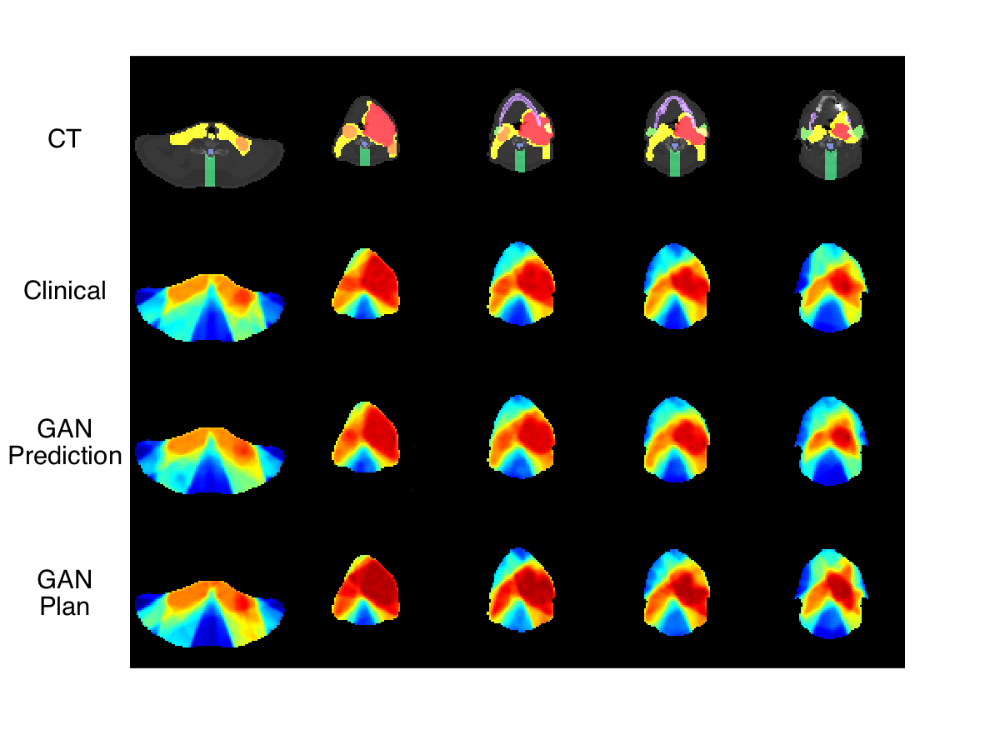

# GANCER: Generative Adversarial Nets for Computationally Efficient Radiotherapy

Code for the paper "Automated Treatment Planning in Radiation Therapy using Generative Adversarial Networks", submitted to Machine Learning in Health Care 2018.

Knowledge-based planning (KBP) is an automated approach to radiation therapy treatment planning that involves first predicting a desirable treatment plan, before correcting it to a deliverable one. In this work, we propose a GAN approach to predicting desirable 3D dose distributions.

This code contains the implementation specifically for the GAN. We will provide the code for the optimization in a later update. Note that the dataset used in the original paper cannot be shared publicly. This will be resolved in a later update, where we will provide a synthetic dataset. Alternatively, you can use a public dataset, such as [CORT](http://gigadb.org/dataset/100110), as long as you modify the dataloader appropriately.



## Prerequisites
- Linux or OS X
- Python 3
- CPU or NVIDIA GPU + CUDA CuDNN

## Getting started
### Installation
- Setup pipenv virtual environment and enter it
```bash
pipenv install --dev --three
pipenv shell
```
- Install PyTorch and dependencies from http://pytorch.org
- Install Torch vision from the source.
```bash
git clone https://github.com/pytorch/vision
cd vision
python setup.py install
```
- Install python libraries [visdom](https://github.com/facebookresearch/visdom) and [dominate](https://github.com/Knio/dominate).
```bash
pip install visdom
pip install dominate
pip install opencv-python
```
- Add checkpoints and datasets directories.
```
cd cancerGAN/
mkdir checkpoints
mkdir datasets
mkdir results
```
- Training on cancer dataset:
```
python train.py --dataroot ./datasets/cancer --name cancer_pix2pix --model pix2pix --which_model_netG unet_256 --which_direction AtoB --lambda_A 100 --dataset_mode slice --no_lsgan --norm batch --pool_size 0 --loadSize 256 --print_freq 200 --batchSize 16 --gpu_ids 0
```
- Testing on cancer dataset:
```
python test.py --dataroot ./datasets/cancer --name cancer_pix2pix --model pix2pix --which_model_netG unet_256 --which_direction AtoB --dataset_mode slice --norm batch --loadSize 256 --phase test --how_many 99999
```
- Training 3d cancer dataset:
```
python train.py --dataroot ./datasets/voxels --name vox2vox --model vox2vox --which_model_netG unet_64_3d --which_model_netD n_layers_3d --which_direction AtoB --dataset_mode voxel --norm batch_3d --loadSize 64 --fineSize 64 --print_freq 100 --gpu_ids 0
```
